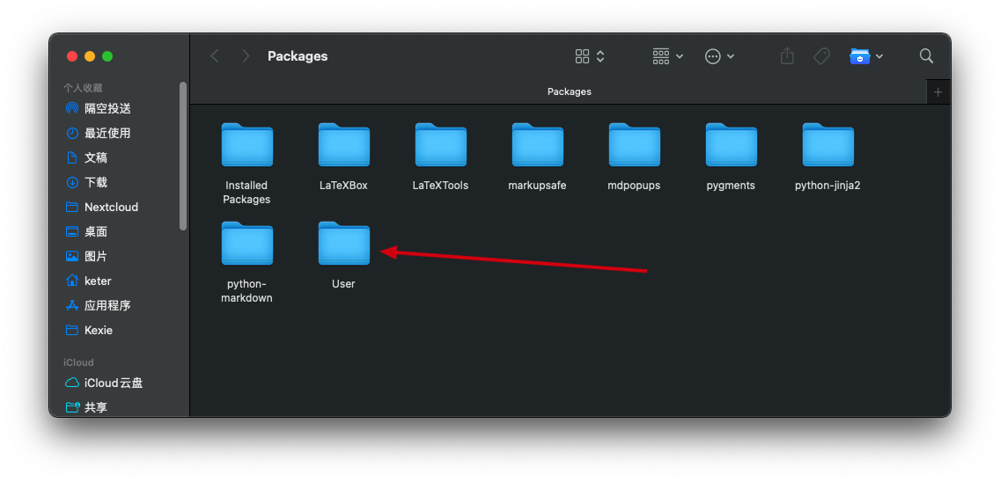
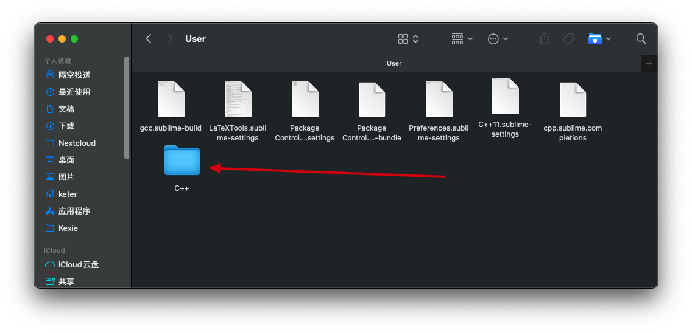
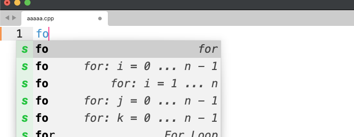

# **[ACWing-completions-in-sublime-txt](https://github.com/AndSonder/ACWing-completions-in-sublime-txt)**

## 目的

在本地Sublimes txt的环境中使用Acwing中的算法模板级别补全

## 配置教程

首先打开配置路径

然后进入到User文件夹当中

最后将仓库中的C++文件夹copy到这里即可：

再次打开一个cpp文件就可以使用ACWing中的补全了

