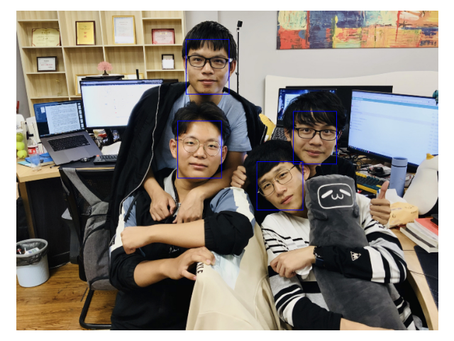

# FaceRecognition-System-Pytorch

## 简介

本项目为一个完整的人脸识别系统，该系统提供了如下功能：

1. 人脸识别
2. 人脸特征提取
3. 人脸对比

## 快速使用

### 环境

```
pip install -r requirement.txt
```

### 下载权重

链接: [https://pan.baidu.com/s/1Yc6X4M9kX-c7hqviXjd6ig?pwd=ei2r](https://pan.baidu.com/s/1Yc6X4M9kX-c7hqviXjd6ig?pwd=ei2r)

将权重放到 /face/facenet/weights 文件夹下

运行 `example.py`

## 算法介绍

人脸识别算法使用了MTCNN算法，人脸特征提取算法使用了FaceNet算法；

MTCNN算法**采用级联CNN结构，通过多任务学习，同时完成了两个任务——人脸检测和人脸对齐，输出人脸的Bounding Box以及人脸的关键点（眼睛、鼻子、嘴）位置**

FaceNet算法**直接学习图像到欧式空间上点的映射，两张图像所对应的特征的欧式空间上的点的距离直接对应着两个图像是否相似**

## API 接口介绍

在 `example.py` 中给出了每个接口的例子

```python
fs = FaceSystem()
```

```python
# 预测人脸的例子
image = Image.open("./images/1.jpg")
result = fs.face_detect(image)
fs.show_face_boxes(image, result)
```




```python
# 打开摄像头进行识别
fs.video_face_reg()
```

```
# 将人脸切割保存
fs.save_faces(image, result)
```


```python
# 提取人脸特征
face1 = Image.open('./images/face_0.jpg')
feature1 = fs.get_face_feature(face1)
face2 = Image.open('./images/face_1.jpg')
feature2 = fs.get_face_feature(face1)
print(feature1.shape)
print(feature2.shape)
```

```
(1, 512)
(1, 512)
```

```python
# 人脸特征对比
dist = fs.feature_compare(feature1, feature2)
dist2 = fs.feature_compare(feature1, feature1)
print(dist)
print(dist2)
```

```
0.8376869
0.0
```

## References

[1] David Sandberg's facenet repo: https://github.com/davidsandberg/facenet

[2] K. Zhang, Z. Zhang, Z. Li and Y. Qiao. *Joint Face Detection and Alignment Using Multitask Cascaded Convolutional Networks*, IEEE Signal Processing Letters, 2016. [PDF](https://kpzhang93.github.io/MTCNN_face_detection_alignment/paper/spl.pdf)

[3] F. Schroff, D. Kalenichenko, J. Philbin. *FaceNet: A Unified Embedding for Face Recognition and Clustering*, arXiv:1503.03832, 2015. [PDF](https://arxiv.org/pdf/1503.03832)

[4] polarisZhao's mtcnn-pytorch repo: https://github.com/polarisZhao/mtcnn-pytorch


